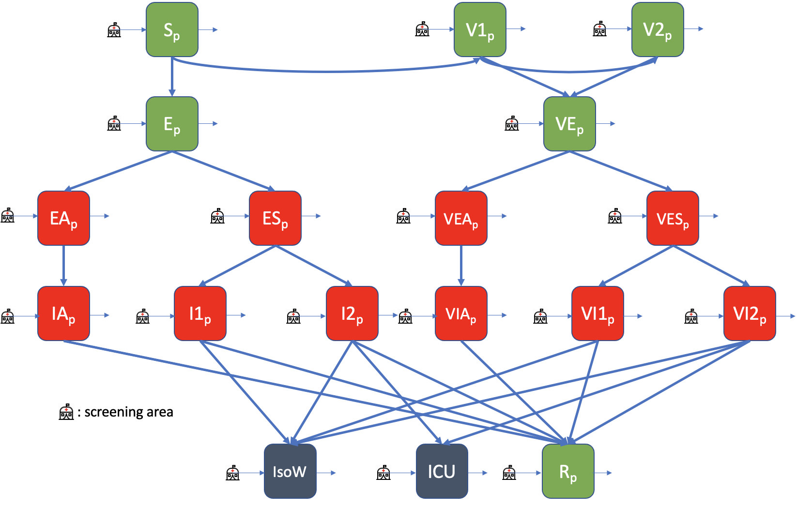
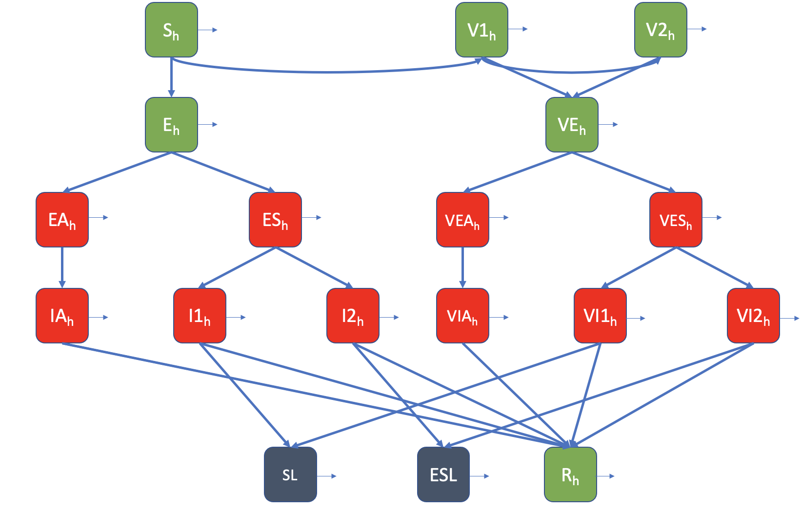

```{r setup, include=FALSE}
knitr::opts_chunk$set(echo = TRUE)
library(igraph)
library(magrittr)
```

## Stochastic Model
Following the 2020 COVID-19 pandemic, this stochastic model has been developed to simulate virus transmission in multi-ward healthcare communities. 

The compartmental model that illustrates the epidemiological status of patients is given below:

{#id .class width=100% height=100%}

 
Similarly, the compartmental model that illustrates the epidemiological status of HCWs is given below:

{#id .class width=100% height=100%}


### Install and load the package

```{r message=FALSE}
library(mwss)
```


# Parameters

## Epidemiological parameters

The model is parametrized with 29 epidemiological parameters: 

- the  effective contact rates between patients (`betaPP`),
- the  effective contact rates between healthcareWorkers (`betaHH`),
- the  effective contact rates between contagious healthcareWorkers and susceptible patients (`betaHP`),
- the  effective contact rates between contagious patients and susceptible healthcareWorkers (`betaPH`),
- the  effective contact rates between patients in an eventual admission airlock (`betaPP_AL`),
- the  effective contact rates between healthcareWorkers in an eventual admission airlock (`betaHH_AL`),
- the  effective contact rates between contagious healthcareWorkers and susceptible patients in an eventual admission airlock (`betaHP_AL`),
- the  effective contact rates between contagious patients and susceptible healthcareWorkers in an eventual admission airlock (`betaPH_AL`),
- the  relative risk of transmission of asymptomatics compared to symptomatics (`Ta`)
- 1 /  duration of non contagious incubation period  (`gamma1`),
- 1 /  duration of contagious incubation period (`gamma2`),
- 1 /  duration of contagious period when asymptomatic and non severe symptoms (`gamma3`),
- 1 /  duration of contagious period when severe symptoms (`gamma4`),
- 1 /  duration of stay in intensive care before recovery or death (`gamma5`),
- 1 /  duration of contagious period before transfer when severe symptoms (`gammaT`),
- 1 /  duration before sick leave when mild symptoms (`gammaBSL`),
- 1 /  duration of sick leave (`gammaSL`),
- 1 /  duration of extended sick leave (`gammaESL`),
- 1 /  duration between first symptoms and transfer in a specific ward designated to isolate symptomatic patients (`gammapreIso`),
- 1 /  duration of stay in a specific ward designated to isolate symptomatic patients (`gammaIso`),
- the  duration of stay in the admission airlock for clinical examination in hours (`timeExCli`)
- the  duration of stay in the admission  airlock for PCR testing in hours (`timeTest`)
- the  number of health care worker in airlock (`nHCWS_AL`). It can be equal to the string "all" or to a number. If it is up to the HCWS population size, it is change for the HCWS population size.
- the  probability of symptoms (`p`),
- the  probability of severity if symptoms (`p2`),
- the  probability of severity if symptoms for patient (`p2p`),
- the  probability of dying in intensive care after severe symptoms for patient (`pDIC`),
- the  probability of dying after severe symptoms for HCWS (`pD`),
- the  probability of being transferred after severe symptoms (`pT`),
- the  probability that HCWS take SL after mild symptoms (`pSL`),
- the  probability that HCWS take ESL after severe symptoms (`gammaESL`)
- the  prevalence in general population (`PrevCom`). It can be stable over time (unique number between 0 and 1) or modifyed on a daily basis (vector of numbers between 0 and 1). If it is a vector, it`s length has to be superior or equal to the number of simulated days,
# FIX ME: prevalence in the general population in lower in vaccinated population isn't it?
- the  sensitivity of RT-PCR test when testing contagious individuals (`sensInf`),
- the  sensitivity of RT-PCR and Ag-RDT tests when testing non-contagious individuals (`sensNInf`),
- the  sensitivity of Ag-RDT test when testing contagious individuals (`sensInfAnt`),
- the  sensitivity of Ag-RDT test when testing contagious individuals in incubation (`sensIncInfAnt`),
- the  sensitivity of RT-PCR test when testing contagious individuals in incubation (`sensIncInf`),
- the  number of weekly tests in case of weekly testing or testing strategy requiring fix number of weekly tests (`nWeeklyTest`),
- in case of systematic testing of all individuals in a ward, number of days till possible next round of testing of already tested ward (`nDaysRepWTest`),
- proportion of the population vaccinated (`PrevVacc`),
# FIX ME: propV1 and propV2 could be replace by the probability to maintain immunity through boosters
- among those vaccinated, propotion with one dose (or can be interpreted as two doses) (`propV1`),
- among those vaccinated, proportion with two doses  (or can be interpreted as a booster shot) (`propV2`),
- probability of taking first dose of vaccine for patients (`pv1p`),
- probability of taking first dose of vaccine for HCWs (`pv1h`),
- probability of taking second dose of vaccine for patients (`pv2p`),
- probability of taking second dose of vaccine for HCWs (`pv2h`),
- 1 / duration (in days)  to attain V1 immunity (`gammav1`),
- 1 / duration (in days)  to attain V2 immunity (`gammav2`),
- probability of infection for partially vaccinated patients / HCWs (`pInfV1`),
- probability of infection for fully vaccinated patients / HCWs (`pInfV2`),
- probability of developing symptoms for those vaccinated (`psv`),
- probability of severe symptoms for vaccinated patients (`p2pv`),
- probability of severe symptoms for vaccinated HCWs (`p2v`),
- probability of death for vaccinated HCWs with severe symptoms (`pDv`),
- probability of transfer to ICU for vaccinated patients with severe symptoms (`pTv`),
- 1 / daily number of visitors (`gammaVin`),
- 1 / duration of stay of visitors in the ward (`gammaVout`).

The PCR test specificity is assumed to be 100%.


```{r}
params = list(
  betaPP     = 0.35,
  betaHH     = 0.35,
  betaPH     = 0.35,
  betaHP     = 0.6,
  betaVP     = 0,
  betaPP_AL  = 0.35,
  betaHH_AL  = 0.35,
  betaPH_AL  = 0.35,
  betaHP_AL  = 0.6,
  Ta = 0.35,
  gamma1 = 1 / 5,
  gamma2 = 1 / 2,
  gamma3 = 1 / 7,
  gamma4 = 1 / 8,
  gamma5 = 1 / 10,
  gammaT = 1 / 2,
  gammaBSL = 1 / 1,
  gammaSL = 1 / 14,
  gammaESL = 1 / 28,
  gammapreIso = 1 / 1,
  gammaIso = 1 / 11,
  timeExCli = 1,
  timeTest = 1,
  nHCWS_AL = 1,
  p = 70 / 100,
  p2 = 20 / 100,
  p2p = 50 / 100,
  pDIC = 50 / 100,
  pD = 10 / 100,
  pT = 20 / 100,
  pSL = 80 / 100,
  pESL = 100 / 100,
  sensInf = 90 / 100,
  sensNInf = 30 / 100,
  sensInfAnt = 70 / 100,
  sensIncInfAnt = 38 / 100,
  sensIncInf = 42 / 100,
  PrevCom = 0.01,
  PrevVacc = 0.5,
  propV1 = 0.2,
  propV2 = 0.8,
  pv1p = 0.3,
  pv1h = 0.1,
  pv2p = 0.3,
  pv2h = 0.1,
  gammav1 = 1 / 14,
  gammav2 = 1 / 14,
  pInfV1 = 0.7,
  pInfV2 = 0.5,
  psv = 0.2,
  p2pv = 0.2,
  p2v = 0.05,
  pDv = 0.1,
  pTv = 0.1,
  gammaVin = 0,
  gammaVout = 0
)
```

## Simulation parameters
Define the structure of the model.

The model is parametrized with 6 parameters: 

- the  number of ward (`wards_names`: vector of wards unique identifier),
- the  number of patients per ward (`pop_size_P`: vector of integers in the same order than `wards_names`),
- the  number of health care workers per ward (`pop_size_H`: vector of integers in the same order than `wards_names`),
- the  number of visitors per ward (`pop_size_V`: vector of integers in the same order than `wards_names`),
- the  daily admission rate per treatment bed per ward (`turnover`: vector of rates (between 0 and 1) in the same order than `wards_names`),
- the  initial epidemiological status of the population (`introduction`: data.frame describing non susceptible individuals par wards: `wards_names`, `number` (of individuals), `type` (of individual, it has to be `P` for Patient or `HCWS` for health care workers), `epiStat` (epidemiological state at t=0, it must be `E`, `EA`, `ES`, `IA`, `I1`, `I2`, `V1`, `V2`, `VE`, `VEA`, `VES`, `VIA`, `VI1`, `VI2`or `R`)). If the population is fully susceptible `introduction = "None"`.
- the  connection between wards through health care workers either through multi-assignments or cover (`matContact`:  Matrix reporting  the proportion of time spent by health care workers in the different wards.)


Building toy data to test the package:

```{r}
nwards <- 5
wards_names_ex <- letters[1:nwards]
pop_size_P_ex <- rep(20, nwards)
pop_size_H_ex <- rep(15, nwards)
pop_size_V_ex <- rep(0, nwards)
turnover_ex <- rep(21,nwards)
matContact_ex <- matrix(1/nwards, nrow = nwards, ncol = nwards)
rownames(matContact_ex) <- wards_names_ex
colnames(matContact_ex) <- wards_names_ex
# or 
matContact_ex2 <-randomContacts(pop_size_H_ex, wards_names_ex)
matContact <- matContact_ex2$contactMat
```

The function `startvec` allows to produce the population matrix at t=0.
The function `plot_wardsConnect` produce a plot of the wards network connected through multi-assignements or cover of health care workers.

```{r, fig.width=7, fig.height=6}

xstart <- startvec(ward_names = wards_names_ex, 
                   pop_size_P = pop_size_P_ex, 
                   pop_size_H = pop_size_H_ex, 
                   nVisits = pop_size_V_ex, 
                   LS = turnover_ex)
plot_wardsConnect(matContact, pop_size_P_ex, verbose = FALSE)
```

Define the characteristics of the simulations:

- the number of iterations (`nSimulations`),
- the number of simulated days per iterations (`duration`),
- is there a designated ward to isolate symptomatic patients from patients and HCWS? (`isoWard`: logical. `TRUE` or `FALSE`). Symptomatic patients are tested and transferred to the isolated ward when positive. New patient can also be tested according to the testing strategy implemented
- is there an airlock procedure to isolate new patients before clinical examination? (`airlockEffective`: logical. `TRUE` or `FALSE`).    If `TRUE`, define the related epidemiological parameters (`betaPPairlock`,  `betaHHairlock`,  `betaPHairlock` ,  `betaHPairlock`, `timeExCli`,  `timeTest` and  `nHCWS_AL`).
- is there any specific control measures implemented? (`scenario`: no specific control measures are implemented (`FALSE`); in the absence of designated ward, symptomatic patients are isolated from other patients in the ward (`"IsoPatSymp"`) ; a general airlock has been implemented where the new patient are neither in contact with patient of the ward nor with the health care workers (`"airlockGlobal"`).
- what virological testing strategy is implemented? (`test_str`: no one is tested (`none`); symptomatic new patients are tested (`"symp"`) ; all new patients are tested (`"all"`); in each ward, all new patients are tested in a pool at the end of the day, if the result is positive, all new patients are individually tested and transferred either in the ward or in the isolated ward (`"poolunit"`); and all new patients of the network are tested in a collective pool at the end of the day, if the result is positive, all new patients are individually tested and transferred  either in their ward or in the isolated ward (`"poolhosp"`).

```{r}
  nSimulations  <- 1
  duration      <- 30
  isoWard <- TRUE
  airlockEffective      <- FALSE
  scenario              <- FALSE
  test_str              <- "none"
  Vaccination <- TRUE
```

# Simulations

### Launch a run

Generate the initial vector of the population based on the previously defined parameters.
  
```{r eval = FALSE}
xstart <- startvec(ward_names = wards_names_ex, 
                   pop_size_P = pop_size_P_ex, 
                   pop_size_H = pop_size_H_ex, 
                   nVisits = pop_size_V_ex, 
                   LS = turnover_ex)
```  

Launch the run.

```{r eval = FALSE}
output <- mwss(params, xstart, matContact, nSimulations, duration, isoWard, airlockEffective, scenario, test_str)
```   

The output object is a list of `nSimulations` lists. Each list is composed of as much matrices as simulated wards. The daily population vectors, incidence, transmissions and deaths events, and number of tests and admissions are summarized in each matrix.


### Explore output

Use the `summary` function to explore the outputs at the whole system scale.

```{r eval = FALSE}
  output_res <- summary(output, test_str)
  output_res$nSimulations
  output_res$nWards
  output_res$TrSec
  output_res$incidence
  output_res$nTestsHosp
  output_res$nDailyTestsHosp
  
  plotDailyTest(output_res$nDailyTestsHosp$perSim)
```   

Use the `ward` focus of the `summary` function to explore the outputs at ward scale.

```{r eval = FALSE}
  output_resW <- summary(output, focus = "ward")
  output_resW$TrSec
  output_resW$incidence
```   

Functions `summary` with specific focus are also available to explore only transmission events or symptomatic incidence.

```{r eval = FALSE}
summary(output, focus = "transmission")

summary(output, focus = "incidence")
```   

## How to estimate the probability of spread in the ward network following a specific introduction?
Prevent all introductions to append by setting the prevalence in general population at `0`.

```{r}
params$PrevCom <- 0
```   

Adjust the initial population vector by adding infected individuals in desired stage and wards.

Verify the initial population vector and parameters.

Define characteristics of the simulation and launch the run.

For example:

```{r}

  IMMstate <- data.frame(ward = c("a", "c", "b"), pop = c("p","p", "h"), imm = c("PI", "FI", "FI"), n = c(3, 2, 10))
  EPIstate <- data.frame(ward = c("b", "d"), pop = c("p","h"), imm = c("NI", "NI"), epi = c("E", "E"), n = c(1, 1))

  xstart <- startvec(ward_names = wards_names_ex, 
                   pop_size_P = pop_size_P_ex, 
                   pop_size_H = pop_size_H_ex, 
                   nVisits = pop_size_V_ex, 
                   LS = turnover_ex,
                   IMMstate = IMMstate,
                   EPIstate = EPIstate,
                   AL = TRUE,
                   AL_nHCWS = 1)
  
  nSimulations  <- 3
  duration      <- 30 #days
  isoWard <- TRUE
  airlockEffective      <- TRUE
  
  output <- mwss(params, xstart, matContact, nSimulations, duration, isoWard, airlockEffective)
```   

Use `transmission` focus of the `summary` function to explore the number of simulation where no secondary transmission happens.

```{r}
  transmission_res <- summary(output, focus = "transmission")
  
  plot_pOutbreak(output, matContact_ex, pop_size_P_ex, verbose = FALSE)

  plotDailyTest(summary(output, test_str)$nDailyTestsHosp$perSim, startday = FALSE)
  
  plotcumInc(output)
```   
